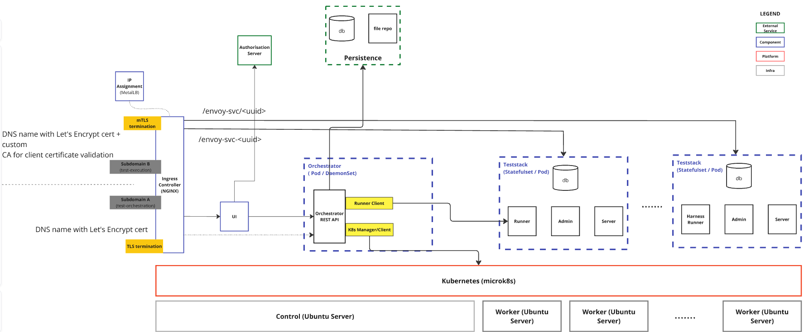

# cactus-juice-deploy: CACTUS + cactus-juice on a single host

Deploys, all on one machine using rootful Podman:

1. The CACTUS stack (**CSIP-AUS Compliance Testing for Utility Services**) - orchestrator, UI, notifications and
   the dynamically created teststack pods (originally from the `cactus-deploy` repository).
2. The cactus-juice frontend (`../frontend`) and 3. FastAPI backend (`../src`).
4. The long-running cactus-juice worker tasks (`juice task csipausclient|satecclient|trocaclient`).

Both CACTUS and cactus-juice share the host's native postgres (separate databases / credentials) and the host's
nginx. All configuration lives in `server/cactus.env` (see `server/sample.cactus.env`). The cactus-juice specific
steps are documented in the [cactus-juice section of server/README.md](./server/README.md#cactus-juice).

It contains the Docker images, PKI tooling, and deployment scripts required to build and operate the Cactus platform on a single host using rootful Podman.

## Overview

This project provides:
- Docker images for custom components in the cactus stack, along with associated build workflows.
- IEEE 2030.5 PKI certificate generation tooling.
- Deployment scripts and nginx configuration for a Podman-based single-host deployment.

## Layered Architecture

The diagram below illustrates the layered architecture of the platform. Teststack instances (each a Podman pod containing envoy, cactus-runner, postgres, taskiq-worker, and pubsub) are provisioned on demand by the orchestrator via the Podman API socket. They are served through the `test-execution` domain, which implements mutual TLS and the AES-128-CCM8 cipher suite as required by IEEE 2030.5.



## Directory Structure

```text
deploy/
├── docker/                        # Dockerfiles for CACTUS components (built + pushed elsewhere)
├── docker/cactus-juice/           # cactus-juice backend/tasks image (built on the host from this repo)
├── docker/cactus-juice-frontend/  # cactus-juice frontend image (built on the host from this repo)
├── server/                        # Deployment scripts, nginx config, and environment template
├── pki/                           # IEEE 2030.5 PKI certificate generation
└── docker/versions.lock           # Pinned CACTUS component versions
```

## Getting Started
Refer to [server/README.md](./server/README.md) for detailed steps on setting up the host, generating PKI artefacts, and deploying services.

Key phases include:
- Infrastructure setup: installing Podman, creating the `cactus-net` network, starting Traefik, installing nginx.
- PKI creation: generating the SERCA/MCA/MICA certificate chain.
- Database setup: creating the external PostgreSQL instance and running Alembic migrations.
- Container deployment: running `update.sh` to start orchestrator, UI, and notifications containers.
- cactus-juice: `setup-juice.sh` (network, DB, basic auth), `nginx-config.sh juice`, then `update-juice.sh` to
  build + migrate + (re)start the juice containers.

**Prerequisites**
- Ubuntu 24.04
- Root access
- External PostgreSQL instance accessible from this host
- nginx with AES-128-CCM8 OpenSSL support (see server/README.md)

## Security Notes
- Scripts and manifests assume hardened Linux systems. Apply baseline OS hardening before deployment.
- Secrets for TLS and application credentials must be securely managed and rotated as required.

## Platform Versioning
Versioning of the platform components is tracked centrally. Each tag in this repository (e.g., release-1, release-2) corresponds to a stable combination of component versions.

Versions of the components used in any given build are defined in [versions.lock](./docker/versions.lock).

### Release notes

Tagging `release-<N>` runs [generate-release-notes.yaml], which diffs `versions.lock` against the previous **numbered** 
release and publishes a GitHub release. Non numeric deploy tags (`release-podman21`) still build images via
`build-push.yaml` but are skipped for release notes.

Two outputs of the release notes script:md body for github UI, and `release-notes.json` release asset for the cactus-ui.

Test procedure versions are derived from cactus-orchestrator's `uv.lock`. Since they are so helpful for clients, we do a 
full check of all commits between releases (e.g. if we deploy a version that skips several tags), and report how many
client test procedures were modified, added and removed between those two test-defs versions.